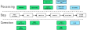

[](https://zenodo.org/badge/latestdoi/112339162)
# tpx3EventViewer

This software converts the sparse event stream (in HDF5) generated by [tpx3HitParser](https://github.com/M4I-nanoscopy/tpx3HitParser) to frames. 



The green blocks are performed by [tpx3HitParser](https://github.com/M4I-nanoscopy/tpx3HitParser) while the blue blocks are done by tpx3EventViewer.


## Getting ready

Download

```
git clone https://github.com/M4I-nanoscopy/tpx3EventViewer.git
cd tpx3EventViewer
```

Recommended way is to use a Python virtualenv. But this is optional.

```
virtualenv tpx3
source tpx3/bin/activate
```

Install Python dependencies

```
pip install -r requirements.txt
```

## Running

```
$./tpx3HitParser.py --help
usage: tpx3EventViewer.py [-h] [-t] [--uint32] [--uint8] [-m] [-f FILE] [-o] [-n] [-r ROTATION] [-g GAIN] [--animation] [--power_spectrum] [--flip_x] [--flip_y] [--hits] [--hits_tot] [--hits_toa] [--gauss GAUSS] [--events_sumtot] [--events_nhits] [--timing_stats]
                          [--tot_threshold TOT_THRESHOLD] [--tot_limit TOT_LIMIT] [--chip CHIP] [--normalize] [--exposure EXPOSURE] [--start START] [--end END] [--super_res N] [--cluster_stats] [--cluster_stats_tot CLUSTER_STATS_TOT] [--cluster_stats_size CLUSTER_STATS_SIZE]
                          FILE

positional arguments:
  FILE                  Input .h5 file

options:
  -h, --help            show this help message and exit
  -t                    Store uint16 .tif file
  --uint32              Store uint32 tif (not supported by all readers!)
  --uint8               Store uint8 tif (supported by almost all readers)
  -m                    Store as mrc file
  -f FILE               File name for .tif file (default is .h5 file with .tif extension)
  -o                    Overwrite existing file
  -n                    Don't show interactive viewer
  -r ROTATION, --rotation ROTATION
                        Rotate 90 degrees (1: clockwise, -1 anti-clockwise, 0: none). Default: 0
  -g GAIN, --gain GAIN  MRC file with gain correction.
  --animation           Store as animated mp4 file
  --power_spectrum      Show power spectrum
  --flip_x              Flip image in X
  --flip_y              Flip image in Y
  --hits                Use hits (default in counting mode)
  --hits_tot            Use hits in ToT mode
  --hits_toa            Use hits in ToA mode
  --gauss GAUSS         Use events, but place back as gaussian with a certain lambda. Default: None
  --events_sumtot       Use events in sumToT mode
  --events_nhits        Use events in nHits mode
  --timing_stats        Show timing stats
  --tot_threshold TOT_THRESHOLD
                        In hits show only hits above ToT threshold
  --tot_limit TOT_LIMIT
                        In hits show only hits below ToT limit
  --chip CHIP           Limit display to certain chip
  --normalize           Normalize to the average (useful for showing ToT)
  --exposure EXPOSURE   Max exposure time in seconds (0: infinite)
  --start START         Start time in seconds
  --end END             End time in seconds
  --super_res N         Up scale the amount of pixels by N factor
  --cluster_stats       Show cluster stats
  --cluster_stats_tot CLUSTER_STATS_TOT
                        Override cluster_stats ToT limit
  --cluster_stats_size CLUSTER_STATS_SIZE
                        Override cluster_stats size limit
```
## Citing

[](https://zenodo.org/badge/latestdoi/112339162)

Please consider citing either or both the Zenodo deposit of this code and our paper:

* van Schayck, J. Paul. (2020). M4I-nanoscopy/tpx3EventViewer. _Zenodo_. https://doi.org/10.5281/zenodo.3693990
* Schayck, J. P. van, Genderen, E. van, Maddox, E., Roussel, L., Boulanger, H., Fröjdh, E., Abrahams, J.-P., Peters, P. J. & Ravelli, R. B. G. (2020). Sub-pixel electron detection using a convolutional neural network. _Ultramicroscopy_, 218, 113091. https://doi.org/10.1016/j.ultramic.2020.113091

## Copyright

(c) Maastricht University

## License

MIT license

## Authors

* Paul van Schayck (p.vanschayck@maastrichtuniversity.nl)
* Raimond Ravelli (rbg.ravelli@maastrichtuniversity.nl) (corresponding)